<h1 align="center">FlowCE</h1>

  <b>Calculus on your TI-84 Plus CE.</b> 
  Type math the way it looks. Get answers the way your textbook writes them.

  
  
  

  
  

FlowCE is a computer algebra system for the TI-84 Plus CE, built for Calc 1 and Calc 2. It gives
exact answers: `π²/6`, not `1.64493`; `ln|sec x + tan x| + C`; `(2n²+3n+1)/(6n²)`. The decimal value
sits right under the exact one. The interface is new from top to bottom: a clean light or dark
look, math drawn as you type it, and keys that work the way a TI user expects.

## Highlights

- **Type math as it looks.** Fractions, powers, roots, integrals, sums, limits and derivatives are
  drawn in 2D while you type. `/` makes a fraction of what is before it, `^` opens an exponent,
  and the arrows move through the boxes in the order you read them.
- **Answers like your textbook.** `arctan((x+1)/2)`, `x − x³/6 + x⁵/120 + O(x⁶)`,
  `C1·cos(x) + C2·sin(x)`, polynomials in descending powers, `log` meaning base 10, `+ C` on
  antiderivatives. Press **F4** for other forms: simplified, one fraction, factored, expanded,
  decimal.
- **Calculus 1 and 2, covered.** Derivatives, integrals (trig integrals, trig substitution,
  partial fractions, arc length and surface area), improper integrals that say *diverges* when
  they do, limits that say *does not exist* (with the left and right values), series and power
  series sums, Taylor series, Riemann sums, differential equations with initial values,
  parametric and polar areas, complex numbers, vectors.
- **Keys that work like a TI's.** `(-)` is a minus sign and `2nd (-)` is **Ans**. Starting a line
  with `×`, `÷`, `+`, `−` or `^` works on the last answer (`× 2 enter` doubles it). `2nd enter`
  brings back your last input (ENTRY), and `sto→` stores (`5 → b`).
- **Graphs.** Graph the line you typed, or the last answer, in one step. Trace along the curve,
  zoom, find roots and extrema, and see a table of values. Two functions get two colors.
- **History and search.** **▲** walks through your past calculations; enter reuses an input or an
  answer. **▼** searches every command, with descriptions and examples (▲ closes it again).
- **Paper and Night themes**, switched instantly from the *more* menu.
- **Stable.** 175 Calc 1 and Calc 2 problems in a row run without a crash. A calculation that runs
  out of memory stops with a message instead of closing the app, and **ON** stops a long one.

## Screenshots

| | | |
|:-:|:-:|:-:|
| 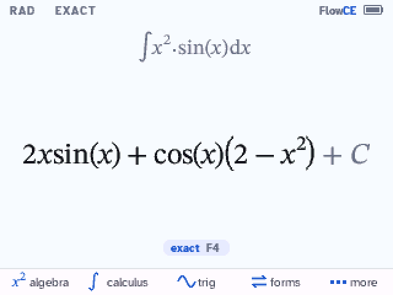 | 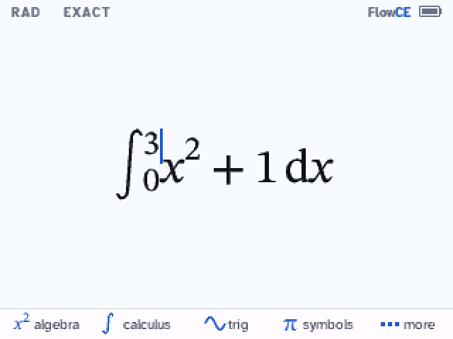 | 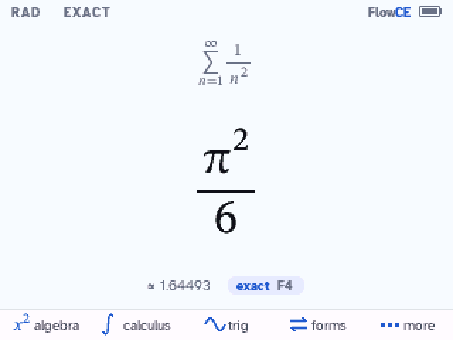 |
| an antiderivative, with `+ C` | typing a definite integral | Σ 1/n² = π²/6 |
| 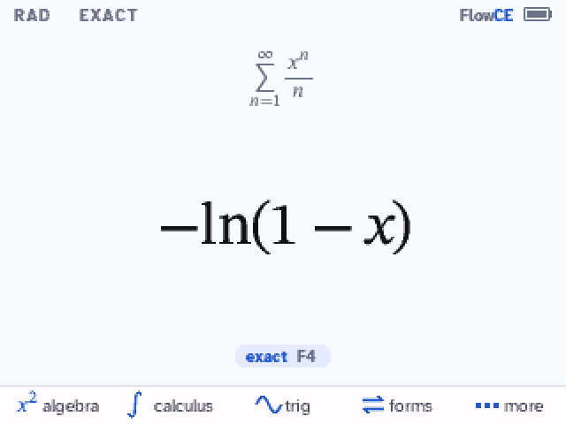 | 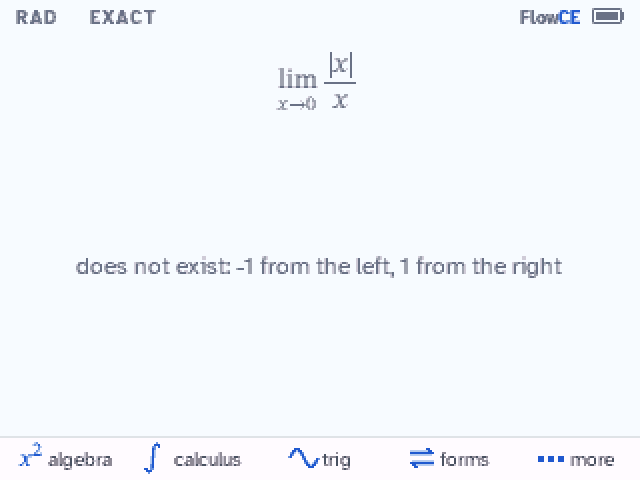 | 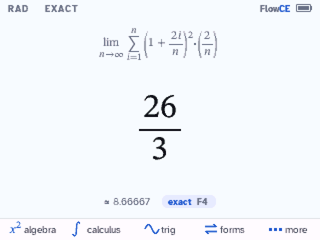 |
| a power series: −ln(1−x) | a limit that does not exist | a Riemann sum, index i |
| 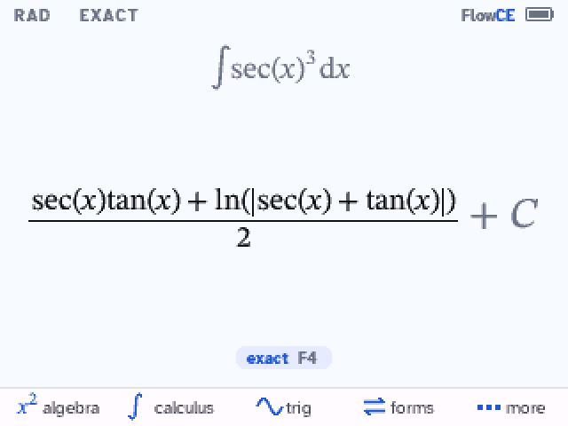 | 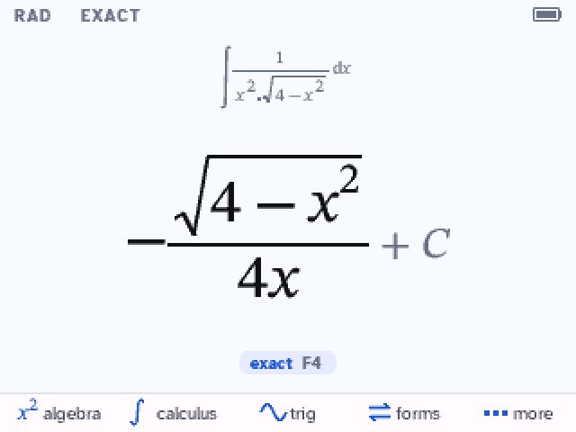 | 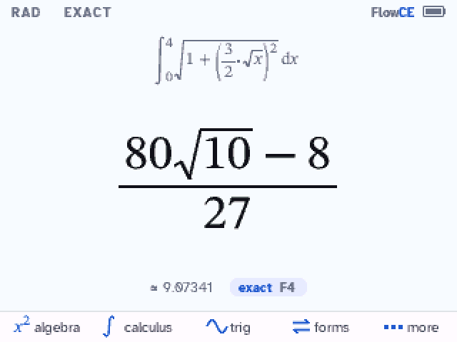 |
| ∫ sec³x | a trig substitution | an exact arc length |
| 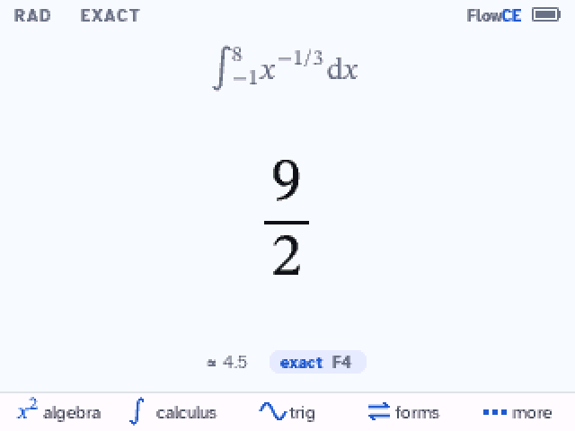 | 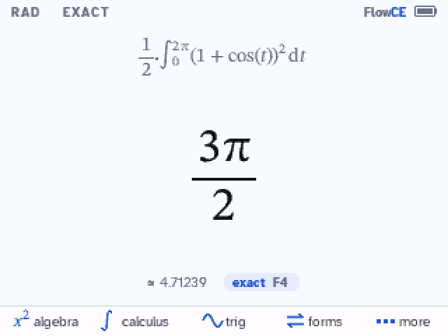 | 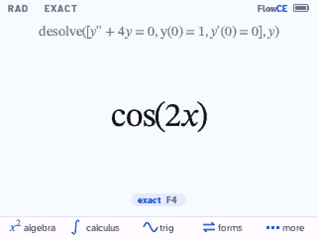 |
| real cube roots: 9/2 | a polar area | an initial value problem |
| 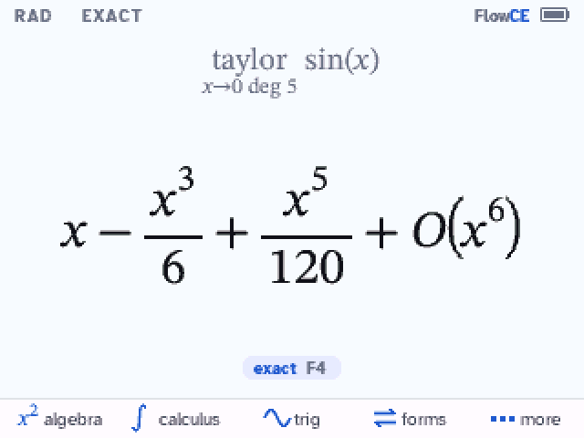 | 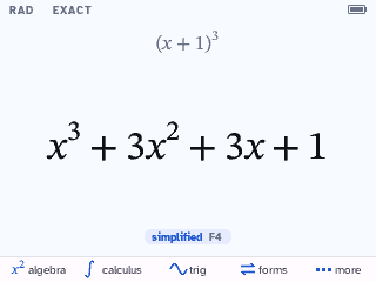 | 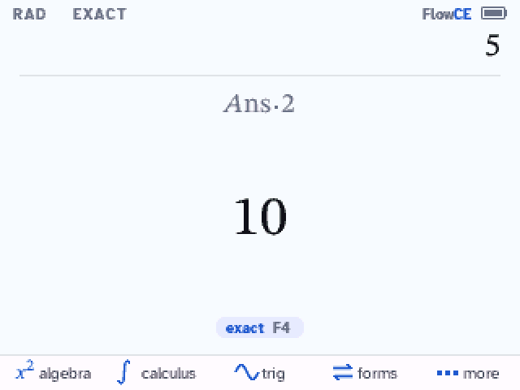 |
| a Taylor series | F4: other forms | `× 2` works on Ans |
| 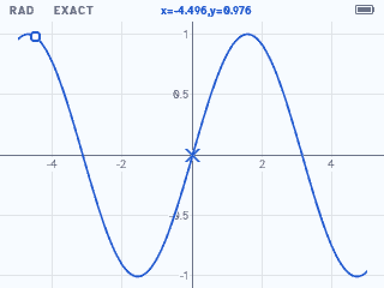 | 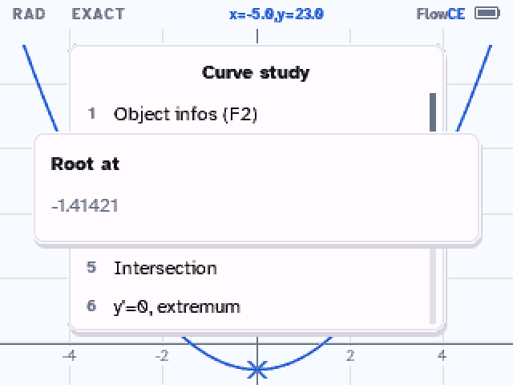 | 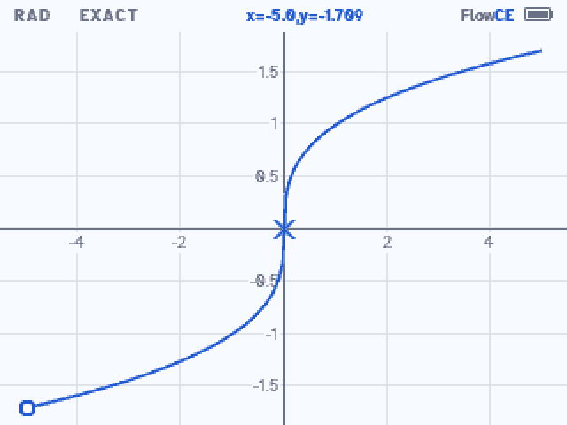 |
| trace along a graph | a root on the graph | x^(1/3), both halves |
| 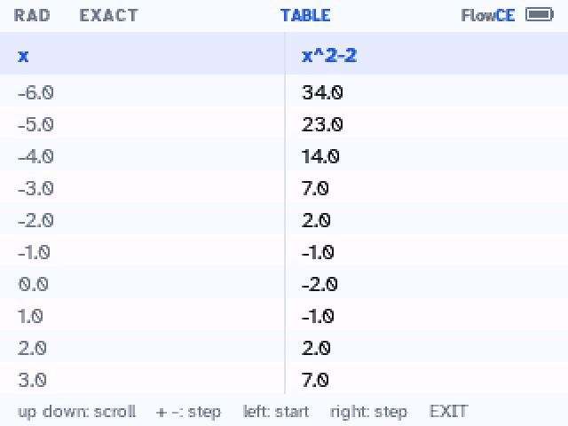 | 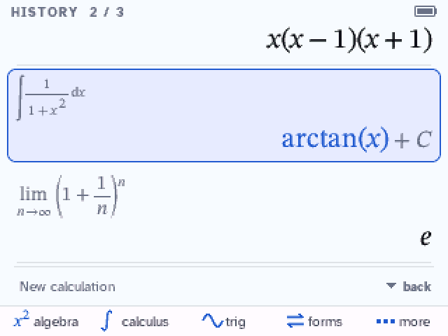 | 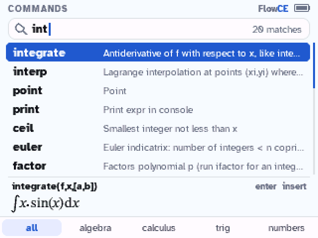 |
| a table of values | history | command search |
| 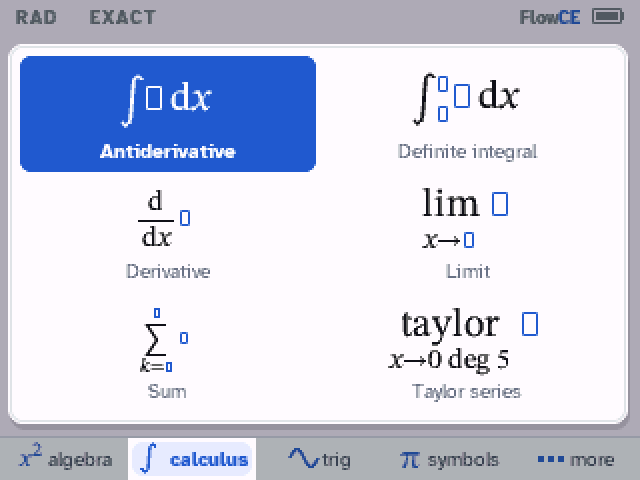 | 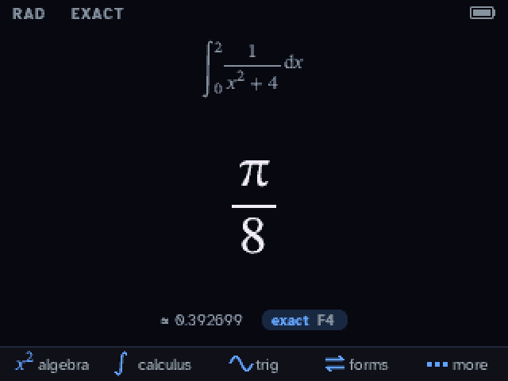 | 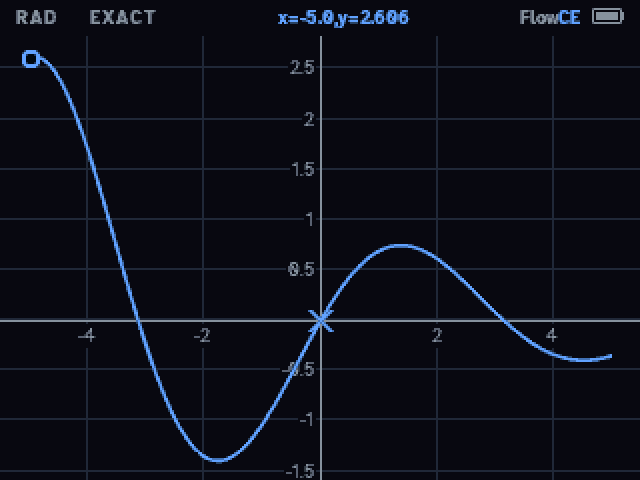 |
| the calculus menu | Night theme | a graph, Night theme |

## Install

You need a **TI-84 Plus CE** (or TI-83 Premium CE) on **OS 5.3 to 5.8.4** (tested on 5.8.0 and
5.8.2; OS 5.8.5 needs [arTIfiCE v3](https://yvantt.github.io/arTIfiCE/), which these steps don't
cover yet), a USB cable and [TI Connect CE](https://education.ti.com/en/products/computer-software/ti-connect-ce-sw).
FlowCE fills most of the memory (about 2.8 MB), so the install starts by clearing it: back up
anything you want to keep first. It takes about 10 minutes. FlowCE is a computer algebra
system: follow your test's calculator rules (some tests, like the ACT, don't allow one).

1. **Clear the memory:** `2nd` `+` (MEM) → `7:Reset...` → right arrow twice to **ALL** →
   `1:All Memory...` → `2:Reset`. This erases everything except the OS: apps, programs and
   variables.
2. **Send the bundle:** download
   [`FlowCE.b84`](https://github.com/tommyb3ll/FlowCE/releases/latest/download/FlowCE.b84)
   (always the latest release), drag it onto the calculator in TI Connect CE and send it
   (45 files: AppIns00-42, A and INST).
3. **Run the installer:** `prgm` → `enter` → `enter` opens the arTIfiCE shell; `enter` starts
   INST and `enter` again installs. It counts down from 42 to 0; don't touch the calculator.
4. At *"Success! Will now reset"*, press `enter` (a few times if the screen looks odd).
5. **Start:** `clear`, then `apps` → **FlowCE**.

What it looks like on the calculator:

| 1. Clear the memory | 3. Run the installer | 5. Start FlowCE |
|:-:|:-:|:-:|
| 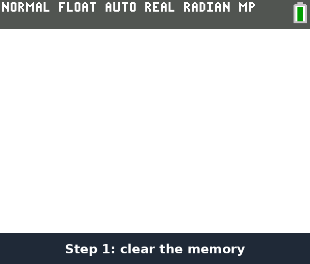 | 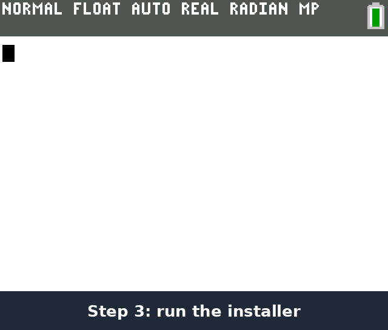 | 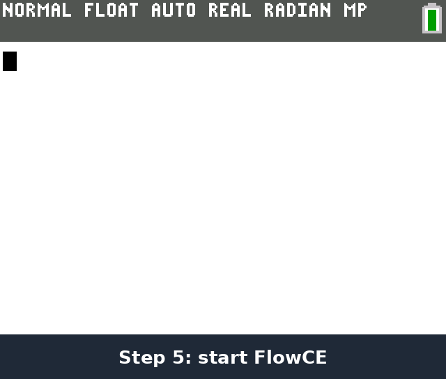 |

**If something goes wrong**
- *The screen freezes at "Success! Will now reset":* press the reset button on the back of the
  calculator (a pen tip or a paperclip). FlowCE stays installed.
- *The calculator acts strangely* (menus glitch, the screen flashes when you plug it in, TI
  Connect CE stays on "refreshing", a Goto error): clear the RAM: `2nd` `+` (MEM) →
  `7:Reset...` → `1:All RAM...` → `2:Reset`. This does not remove FlowCE.
- *The calculator stays unresponsive:* hold the reset button for a few seconds. As a last resort,
  holding `2nd` and `del` while pressing reset lets you send the OS again.

## Keys

| Key | What it does |
|---|---|
| F1 to F5 | menus: algebra, calculus, trig, symbols, more (with `2nd` or `alpha`: more menus) |
| `math` | templates: fraction, root, integrals, derivative, limit, sum |
| ▲ / ▼ | history / search every command |
| `enter` on a history line | reuses that input or answer |
| F4 on an answer | its other forms |
| `(-)` | a minus sign; `2nd (-)` is the last answer (Ans) |
| `+` `−` `×` `÷` `^` `x²` first | works on the last answer, as on a TI (`× 2` is Ans·2) |
| `2nd enter` | the last input again (ENTRY); press again for the one before |
| `sto→` | stores a value: `5 → b` |
| `clear` | erases the line; on an empty line, the answer |
| `/` `^` | a fraction of what is before, an exponent; ▶ leaves it |
| ON or `clear` while computing | stops the calculation |
| *more* → Graph | graphs the line or the answer; in the graph: F2 window and curve study, `2nd graph` table |
| `mode` | settings, shortcuts, about |
| `2nd quit` | quit (your session is kept) |

## Building

FlowCE builds with the [CE C/C++ toolchain](https://github.com/CE-Programming/toolchain) (CEdev
v14.2) plus `g++` and `python3`. Clone with `--recursive` (the engine is the `src/giac`
submodule). `./mkappen` builds the English app: AppIns appvars (`.8xv`) installed by the INST
program, and `FlowCE.b84` for TI Connect CE. `tools/dev/build.sh` builds in WSL from the working
tree, `tools/emu/` drives the CEmu emulator for regression tests, screenshots and the GIFs
above, and `tests/host/` holds host tests of the editor and the 2D layout.

The app must fit in 43 AppIns (at most 2,804,973 bytes); the build prints the room left.

## Credits and license

FlowCE is a fork of [KhiCAS](https://www-fourier.univ-grenoble-alpes.fr/~parisse/) by Bernard
Parisse.

- **Math engine:** Giac, by Bernard Parisse and contributors (Institut Fourier, Université
  Grenoble Alpes).
- **Console interface:** adapted from Eigenmath for the Casio Prizm by G. Maia, Mike Smith,
  Nemhardy and LePhenixNoir.
- **Thanks** to Adrien Bertrand, Xavier Andreani and the TI-83/84 development community,
  especially Jacob Young, commandblockguy and Matt Waltz.
- **Installer:** [arTIfiCE](https://yvantt.github.io/arTIfiCE/) by YvanTT.
- **Fonts:** Atkinson Hyperlegible (Braille Institute) and STIX Two, under the SIL Open Font
  License (`tools/fonts/src`).

FlowCE is free software under the [GNU General Public License](LICENSE), version 3 or later. It
comes with no warranty.
