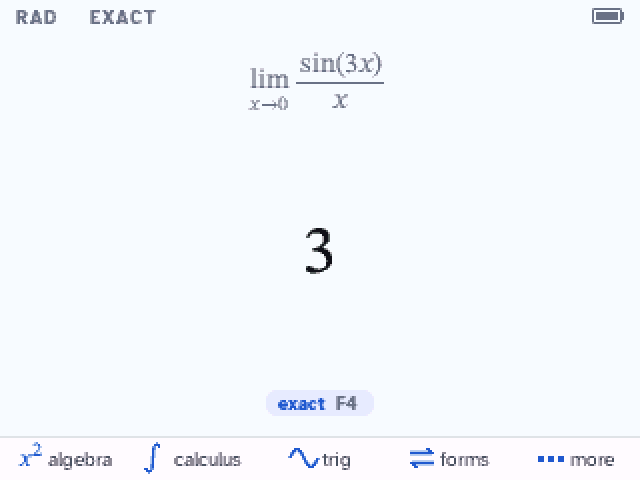
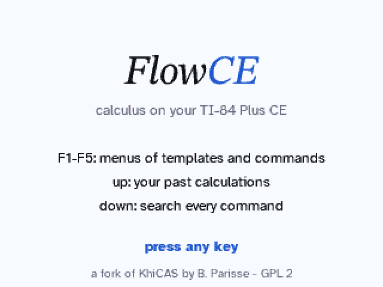

# FlowCE

**Calculus on your TI-84 Plus CE.** A computer algebra system with a modern, textbook-style
interface, made for Calc 1 and Calc 2: integrals, derivatives, limits, series, equations and
graphs, with answers written the way your textbook writes them.

FlowCE is a fork of [KhiCAS](https://www-fourier.univ-grenoble-alpes.fr/~parisse/) by Bernard
Parisse. Its engine is Giac, the computer algebra system of Xcas.

## What it does

- **Type math as it looks.** Fractions, powers, roots, integrals, sums and limits are drawn as
  you type them. `/` makes a fraction of what is before it, `^` opens an exponent, and the
  arrows move through the boxes in the order they are drawn.
- **Answers in textbook form.** `π/2` with `≈ 1.5708` under it, `ln|sec x + tan x| + C`,
  `π²/6`, `x − x³/6 + x⁵/120 + O(x⁶)`, `arctan((x+1)/2)`, `C1·cos(x) + C2·sin(x)`.
- **Other forms with F4:** simplified, one fraction, factored, expanded, decimal.
- **History:** ▲ walks through your past calculations; enter reuses an input or an answer.
- **Search every command:** ▼ opens a search with descriptions and examples.
- **Menus on F1-F5:** algebra, calculus, trig, symbols and more, with templates you fill in.
- **Graphs:** graph the line you typed, or the last answer, in one step. Trace, zoom, find roots
  and extrema, and see a table of values.
- **Paper and Night themes**, switched instantly.
- **Stable in long sessions.** Memory leaks in the engine are fixed, and running out of memory
  stops the calculation with a message instead of closing the app. ON stops a long calculation.

## Screenshots

| | | |
|:-:|:-:|:-:|
|  |  |  |
| exact arc length | ∫ sec³x | a trig substitution |
|  |  |  |
| an initial value problem | a Taylor series | a limit |
|  |  |  |
| history | F4: other forms | command search |
|  |  |  |
| the calculus menu | table of values | a root on the graph |
|  |  |  |
| Night theme | a graph, Night theme | the start screen |

## Install

You need a TI-84 Plus CE (or TI-83 Premium CE) with OS 5.8.0 or older (newer OS versions are
refused, as in KhiCAS), a USB cable and [TI Connect CE](https://education.ti.com/en/products/computer-software/ti-connect-ce-sw).
FlowCE fills most of the archive (about 2.8 MB), so the install starts by clearing it. It takes
about 10 minutes. A simpler install is planned.

1. **Clear the archive** on the calculator: `2nd` `+` (MEM) → `7:Reset...` → right arrow to
   ARCHIVE → `3:Both...` → `2:Reset`. This erases the apps and the archived variables.
2. **Send the bundle:** drag `FlowCE.b84` onto the calculator in TI Connect CE and send it
   (45 files: AppIns00-42, A and INST).
3. **Run the installer:** `prgm` → `A` → `enter` → `enter` (the arTIfiCE shell), then
   `INST` → `enter` → `enter`. It counts down from 42 to 0; do not touch the calculator.
4. At *"Success! Will now reset"*, **do not press enter**: press the RESET button on the back of
   the calculator (a pen tip or a paperclip). "RAM Cleared" appears and FlowCE stays installed.
5. **Start:** `clear`, then `apps` → `FlowCE`.

## Keys

| Key | What it does |
|---|---|
| F1 to F5 | algebra, calculus, trig, symbols, more (with 2nd or alpha: more menus) |
| math | templates: fraction, root, integrals, derivative, limit, sum |
| ▲ / ▼ | history / search every command |
| F4 on an answer | its other forms |
| clear | erases the line; on an empty line, the answer |
| `/` `^` | a fraction of what is before, an exponent; ▶ leaves it |
| `(-)` | a minus sign; 2nd `(-)`: the last answer (ans) |
| ON or clear while computing | stops the calculation |
| more → Graph | graphs the line or the answer; in the graph: F2 window and curve study, 2nd graph: table |
| mode | settings, shortcuts, about |
| 2nd quit | quit (your session is kept) |

## Building

FlowCE builds with the [CE C/C++ toolchain](https://github.com/CE-Programming/toolchain) (CEdev
v14.2) plus `g++` and `python3`, like KhiCAS. `./mkappen` builds the English app: the app is
split into AppIns appvars (`.8xv`) installed by the INST program, and a `.b84` bundle for TI
Connect CE. `tools/dev/build.sh` builds in WSL from the working tree; `tools/emu/` drives the
CEmu emulator for tests and screenshots, and `tests/host/` holds host tests of the editor and
the 2D layout.

The app must fit in 43 AppIns (at most 2,804,973 bytes); the build prints the room left.

## Credits and license

- **KhiCAS and Giac:** Bernard Parisse and contributors (Institut Fourier, Université Grenoble
  Alpes), <https://www-fourier.univ-grenoble-alpes.fr/~parisse/>. KhiCAS credits: interface
  adapted from Eigenmath for Casio Prizm by G. Maia, Mike Smith, Nemhardy and LePhenixNoir;
  thanks to Adrien Bertrand, Xavier Andreani and the TI-83/84 development community,
  especially Jacob Young, commandblockguy and Matt Waltz.
- **Fonts:** Atkinson Hyperlegible (Braille Institute) and STIX Two, under the SIL Open Font
  License (`tools/fonts/src`).
- **License:** FlowCE is free software under the GNU General Public License, like KhiCAS and
  Giac (Giac's sources are GPL version 3 or later).
